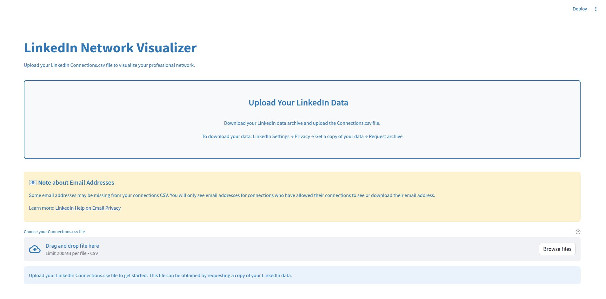
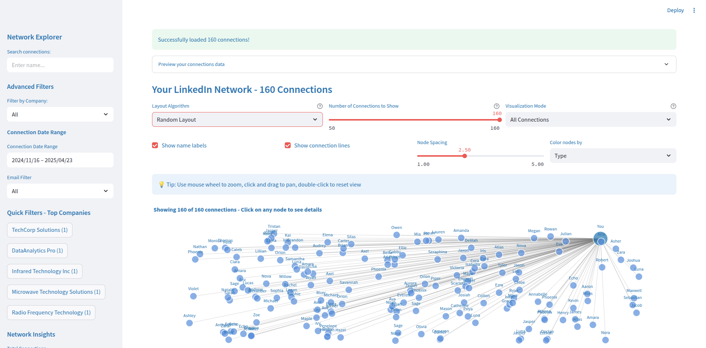
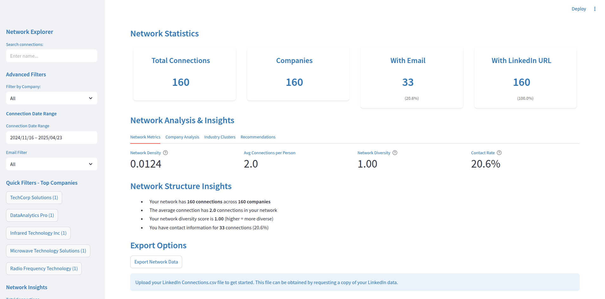

# LinkedIn Network Visualizer

A powerful Python application that transforms your LinkedIn connections data into an interactive network visualization. Analyze your professional network, identify patterns, and gain insights into your career connections.


## 🌟 Features

- **Interactive Network Graph**: Visualize your LinkedIn connections as an interactive network
- **Multiple Layout Algorithms**: Choose from Spring, Circular, Random, or Kamada-Kawai layouts
- **Advanced Filtering**: Filter by company, connection date, email availability, and more
- **Company Analysis**: See distribution across companies and identify networking opportunities
- **Industry Clustering**: Automatic industry classification and analysis
- **Export Capabilities**: Export your network data as JSON for further analysis
- **Privacy-Focused**: All processing happens locally - your data never leaves your machine

## 🚀 Getting Started

### Prerequisites

- Python 3.8 or higher
- pip package manager

### Installation

1. Clone the repository:
```bash
git clone https://github.com/mstatt/LinkedIn-Network-Visualizer.git
cd LinkedIn-Network-Visualizer
```

2. Install required dependencies:
```bash
pip install -r requirements.txt
```

### Running the Application

1. Start the Streamlit application:
```bash
streamlit run app.py
```

2. Open your browser and navigate to `http://localhost:2025`

3. Upload your LinkedIn Connections.csv file to begin.
*** Sample Connections.csv has been provided if you do not have your Linkedin Data yet,

## 📊 How to Download Your LinkedIn Data

1. Go to LinkedIn Settings & Privacy
2. Click on "Privacy" in the left sidebar
3. Click "Get a copy of your data"
4. Select "Connections" (or request the full archive)
5. Click "Request archive"
6. Wait for LinkedIn to prepare your data (this can take up to 24 hours)
7. Download the zip file when ready
8. Extract and upload the `Connections.csv` file to this application

## 🛠️ Technologies Used

- **Streamlit**: For the interactive web interface
- **NetworkX**: For graph creation and analysis
- **Plotly**: For interactive visualizations
- **Pandas**: For data manipulation
- **Bootstrap**: For styling and responsive design

## 📈 Features in Detail

### Network Visualization
- Interactive pan and zoom
- Multiple color coding options (by type, company, connection date)
- Adjustable node spacing and visibility
- Sample size control for large networks


### Screenshots

Initiial Pagen #1            |  Network Connections #2          |  Network Statistiics #3
:-------------------------:|:-------------------------:|:-------------------------:
  |   |  


### Analytics Dashboard
- Network metrics (density, diversity, contact rate)
- Company distribution analysis
- Industry clustering with keyword detection
- Connection timeline analysis
- Personalized networking recommendations

### Data Export
- Export network data as JSON
- Preserve all connection metadata
- Include calculated statistics

## 🔒 Privacy & Security

- **Local Processing**: All data processing occurs on your local machine
- **No External Storage**: Your LinkedIn data is never uploaded to external servers
- **No Tracking**: The application does not collect or transmit any user data
- **Email Privacy**: Respects LinkedIn's email privacy settings

## 🤝 Contributing

Contributions are welcome! Please feel free to submit pull requests, create issues or suggest improvements.

### Development Setup

1. Fork the repository
2. Create a feature branch (`git checkout -b feature/amazing-feature`)
3. Commit your changes (`git commit -m 'Add some amazing feature'`)
4. Push to the branch (`git push origin feature/amazing-feature`)
5. Open a Pull Request

## 📝 License

This project is licensed under the MIT License - see the [LICENSE](LICENSE) file for details.

## 🙏 Acknowledgments

- LinkedIn for providing data export functionality
- The open-source community for the amazing tools that made this project possible
- All contributors and users who provide feedback and suggestions

## Developer

Michael Stattelman - 2025

Project Link: [https://github.com/mstatt/LinkedIn-Network-Visualizer](https://github.com/mstatt/LinkedIn-Network-Visualizer)

---

**Note**: This tool is not affiliated with or endorsed by LinkedIn. It is an independent project designed to help users analyze their own LinkedIn data in accordance with LinkedIn's terms of service and data export policies.


## 📚 Documentation

For detailed documentation and tutorials, please visit the [Wiki](https://github.com/mstatt/LinkedIn-Network-Visualizer/wiki).

## 🐛 Bug Reports

If you encounter any bugs or issues, please report them on the [Issues](https://github.com/mstatt/LinkedIn-Network-Visualizer/issues) page with:
- A clear description of the problem
- Steps to reproduce the issue
- Your operating system and Python version
- Any error messages you encountered
